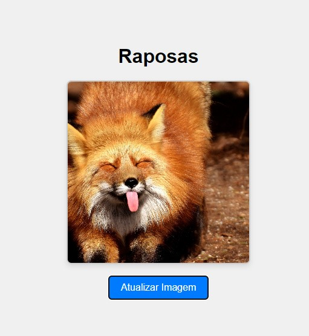

<h1>README - Imagens de Raposa 🦊</h1>

[](https://opensource.org/licenses/MIT)

<h4>Este projeto é uma aplicação web que exibe imagens aleatórias de raposas. Ele utiliza HTML, CSS e JavaScript para criar uma interface interativa onde os usuários podem atualizar a imagem de raposa com um clique de botão. O objetivo aqui é ensinar como consumir dados de APIs usando o método fetch e a crhação de funções em JavaSccript</h4>

<h1>Estrutura do Projeto</h1>
<h4>O projeto é composto por um único arquivo HTML. Aqui está uma visão geral da estrutura:</h4>

<h4>HTML: Define a estrutura básica da página, incluindo uma imagem e um botão.</h4>
<h4>CSS: Estiliza a página para uma melhor apresentação.</h4>
<h4>JavaScript: Faz a chamada à API para obter uma nova imagem de raposa e atualiza a interface.</h4>
<h1>Funcionalidades</h1>
<h4>Exibição de Imagem: A imagem de uma raposa é exibida na página.</h4>
<h4>Atualização de Imagem: Um botão permite ao usuário atualizar a imagem para uma nova raposa aleatória.</h4>
<h4>Carregamento Inicial: Uma imagem é carregada automaticamente ao abrir a página.</h4>
<h1>Tecnologias Utilizadas</h1>
<h4>HTML5: Para estruturar o conteúdo da página.</h4>
<h4>CSS3: Para estilização e layout responsivo.</h4>
<h4>JavaScript: Para interatividade e manipulação do DOM.</h4>
<h4>API: Utiliza a API Random Fox para obter imagens de raposas.</h4>
<h1>Detalhes do Código</h1>

<h1>HTML:</h1>

<p> O elemento img é usado para exibir a imagem da raposa. O valor do atributo src será estabeelcido no JS  
O botão chama a função getFoxIMG() quando clicado. </p>

```

    <button onclick="getFoxIMG()">Atualizar Imagem</button>
```
<h1>CSS:</h1>

<h4>Estilização do corpo da página para centralizar o conteúdo.
Estilos aplicados à imagem e ao botão para melhorar a aparência.</h4>

```
<style>
        body {
            font-family: Arial, sans-serif;
            display: flex;
            flex-direction: column;
            align-items: center;
            justify-content: center;
            height: 100vh;
            margin: 0;
            background-color: #f0f0f0;
        }
        img {
            width: 300px;
            height: 300px;
            object-fit: cover;
            border: 2px solid #ccc;
            border-radius: 8px;
            box-shadow: 0 4px 8px rgba(0, 0, 0, 0.1);
        }
        button {
            margin-top: 20px;
            padding: 10px 20px;
            font-size: 16px;
            color: #fff;
            background-color: #007BFF;
            border: none;
            border-radius: 5px;
            cursor: pointer;
            transition: background-color 0.3s;
        }
        button:hover {
            background-color: #0056b3;
        }
    </style>
```
<h1>JavaScript:</h1>

A função getFoxIMG() faz uma chamada à API e atualiza a imagem segindo a seguinte lógica: <br>
    
```
 <script>
        function getFoxIMG() {
//O método fetch() é utilizado para obter os dados da API. Ele recebe como argumento a url cuja requisição  será convertida em um objeto em formato JSON

            fetch(https://randomfox.ca/floof/)
                .then(response => response.json())
                .then(data => {
                    document.getElementById('foxImage').src = data.image;
                })
                .catch(error => console.error('Erro:', error));
        }

        // Carregar uma imagem ao iniciar
        getFoxIMG();
    </script>
```


<h1>Resultado visual</h1>
O código presente neste repositório, quando executado em um navegador apresenta o versículo no centro da página, como mostra a imagem a seguir


<h2 id="autores"> Autores </h2>

<h3>Naomi Arakaki</h3>


[](https://www.linkedin.com/in/naomi-suguimoto-57436b290)

[](mailto:arakakinaomi228@gmail.com)


<h3>Gabriel Aboboreira</h3>


[](https://www.linkedin.com/in/gabriel-aboboreira/)

[](mailto:masterkillbr007@gmail.com)


<h3>Ana Julia Blande</h3>

[](https://www.linkedin.com/in/gabriel-aboboreira/)

[](mailto:anajblande04@gmail.com)


